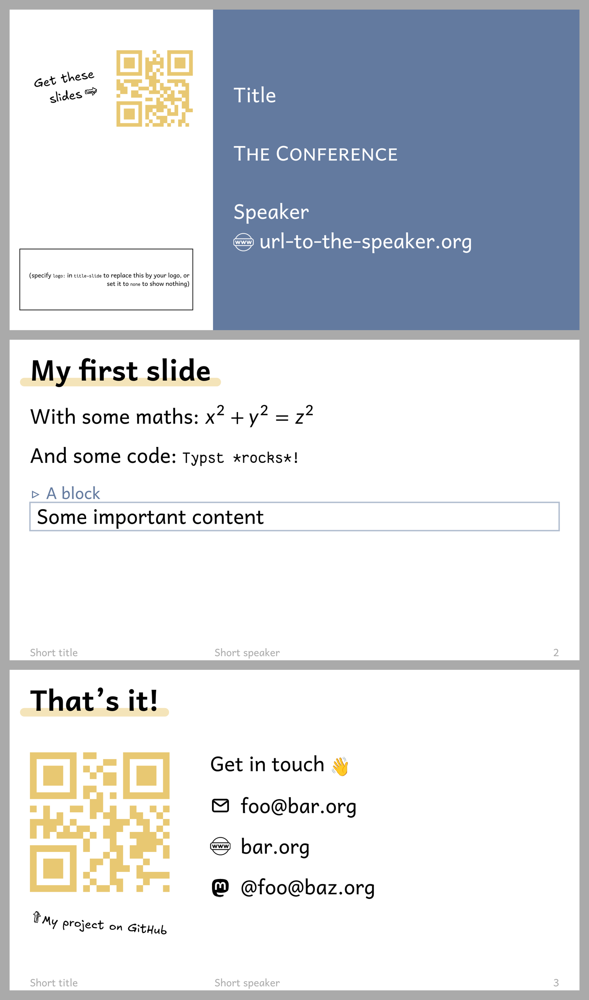

# Friendly

A friendly and playful template for creating presentation slides with Typst and
[Polylux](https://github.com/polylux-typ/polylux/).




Use via
```sh
typst init @preview/friendly-polylux your-cool-project
```

A `slides.typ` file will be created for you that you can directly edit to get
going.

At the top of the generated `slides.typ`, you will find
```typ
#show: friendly.setup.with(
  // ...
)
```
which you can edit to configure the template

## Fonts

By default, the template uses the fonts
[Andika](https://software.sil.org/andika/download/),
[Fantasque Sans Mono](https://github.com/belluzj/fantasque-sans/releases),
and
[Excalifont](https://plus.excalidraw.com/excalifont).
Either make sure you have them installed or specify other fonts in the template.

